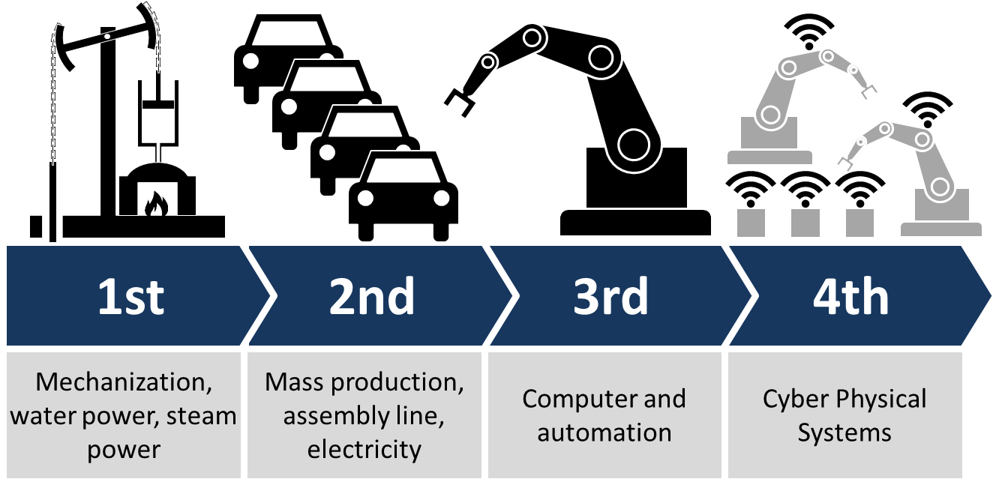
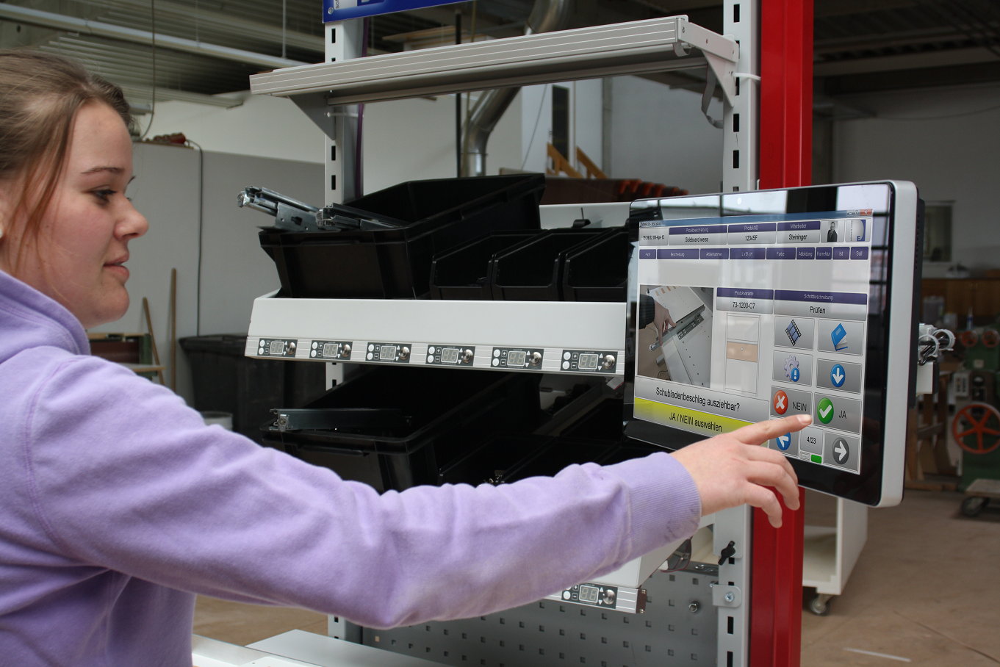
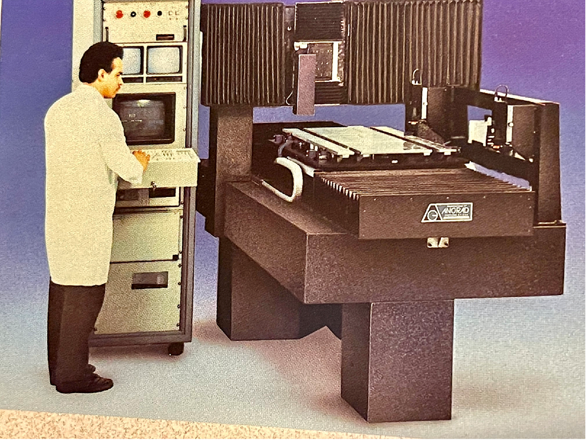
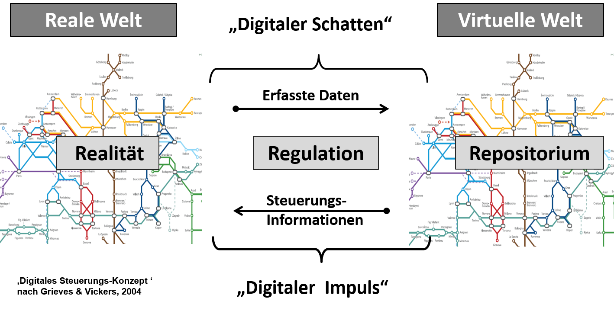
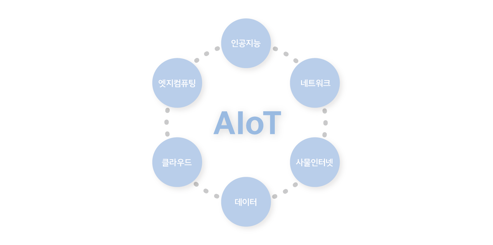
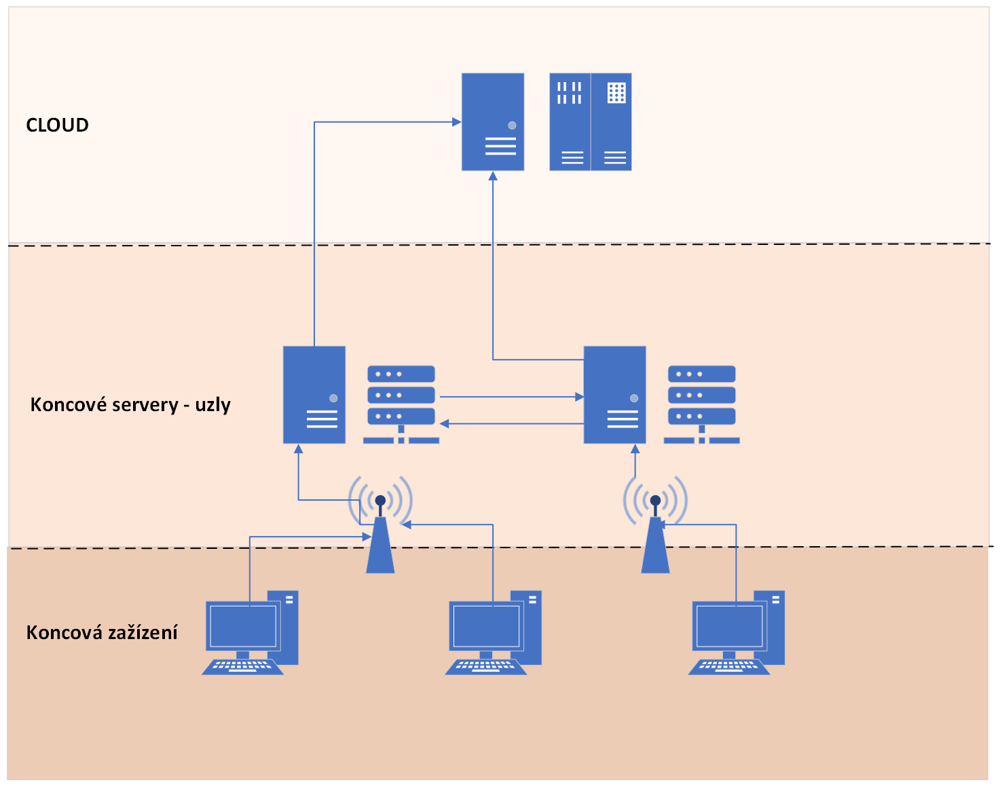

# 工业AI实战：智能制造场景下的技术落地与深度解析

> "工业 AI 不是把 ChatGPT 装到工厂里，而是用数据驱动决策，让每一台设备、每一条产线都变得更聪明。"——这是一位做了十年工业 AI 的 CTO 的原话。

智能制造是工业 AI 最大的落地方向，也是当前制造业转型的核心命题。本文系统梳理工业 AI 在智能制造中的技术架构、核心场景、落地挑战与实战案例，结合多个真实项目的经验教训，为从业者提供可落地的技术参考。

---

## 一、工业 AI 是什么？——不是"ChatGPT 进工厂"

### 明确定义

**工业 AI 是将人工智能技术（机器学习、深度学习、优化算法等）应用于工业生产全流程，实现感知、决策、执行的智能化闭环。**

它和消费级 AI 有本质区别：

| 维度 | 消费级 AI | 工业 AI |
|------|----------|--------|
| **数据特征** | 非结构化为主（文本、图像） | 时序数据为主（传感器、PLC） |
| **延迟要求** | 秒级可接受 | 毫秒级（质检）到分钟级（排产） |
| **可靠性要求** | 容错率高（推荐错了无所谓） | 容错率极低（误检导致停线，漏检导致质量事故） |
| **可解释性** | 可选 | 必须（工艺工程师不信任黑盒） |
| **典型场景** | 聊天、推荐、搜索 | 预测性维护、质量检测、工艺优化、排产调度 |
| **数据量** | 海量（互联网数据） | 有限（故障样本稀少，异常数据不足） |

> **关键认知**：工业 AI 的核心难点不是算法，而是**数据质量**和**领域知识**。一个不理解工艺的算法工程师，写出的模型大概率无法上线。

### 工业 AI 的技术栈



*工业4.0信息管理架构：从传感器到企业层的数据流通（来源：Wikimedia Commons, CC BY-SA 4.0）*

```
┌─────────────────────────────────────────────┐
│              业务决策层                        │
│   排产优化 · 供应链协同 · 能耗管理             │
├─────────────────────────────────────────────┤
│              AI 算法层                        │
│   时序预测 · 异常检测 · 视觉检测 · 强化学习    │
├─────────────────────────────────────────────┤
│              模型工程层                        │
│   特征工程 · 模型训练 · 边缘部署 · MLOps      │
├─────────────────────────────────────────────┤
│              数据基础层                        │
│   SCADA · PLC · 传感器 · MES · ERP          │
├─────────────────────────────────────────────┤
│              基础设施层                        │
│   边缘计算 · 工业网关 · 5G/Wi-Fi6 · 云平台    │
└─────────────────────────────────────────────┘
```

---

## 二、智能制造六大核心场景

### 场景一：预测性维护（Predictive Maintenance）

**业务痛点**：设备突发故障导致非计划停机，一条产线停机 1 小时损失可达数十万元。

**传统做法**：

- 定期维修（过维修：好设备也拆，浪费成本）
- 事后维修（欠维修：坏了才修，损失巨大）

**AI 方案**：

基于设备运行数据（振动、温度、电流、油压等），预测设备健康状态和剩余使用寿命（RUL）。



*工业4.0信息管理架构：数据从现场传感器到云端的全链路流通（来源：Wikimedia Commons, CC BY-SA 4.0）*

| 技术路线 | 算法 | 适用条件 |
|---------|------|---------|
| 基于物理模型 | 剩余寿命退化模型 | 有明确的退化机理 |
| 基于统计学习 | ARIMA、PCA 异常检测 | 有足够历史数据，故障模式稳定 |
| 基于深度学习 | LSTM、Transformer 时序预测 | 多变量耦合，非线性退化 |
| 基于迁移学习 | 领域自适应 | 新设备缺少故障样本 |

**落地要点**：

1. **数据采集是前提**：很多工厂连传感器都没装全，谈何预测？建议从关键设备（高价值、高故障率）开始
2. **故障样本稀少**：设备很少坏，正常数据多、异常数据少——严重类别不平衡。解决方案：数据增强、异常检测（而非分类）、迁移学习
3. **可解释性要求高**：维修工程师需要知道"为什么模型判断即将故障"，否则不会采取行动。建议使用 SHAP 值、注意力可视化等可解释方法
4. **从异常检测起步**：直接预测 RUL 难度很大，先做"是否异常"的二分类，逐步升级

#### 实战案例：基于振动信号的设备故障预测与制程监测系统

某制造企业开发了一套基于振动信号的预测性维护系统，核心技术路线如下：

- **数据采集**：在关键设备上部署高灵敏度振动传感器，实时采集运行数据
- **信号处理**：对原始振动信号进行频域/时域特征提取（FFT 变换、包络分析等）
- **模型构建**：结合 AI 算法建立故障预测模型和制程监测模型，实现异常预警
- **成果**：故障预测准确率显著提升，已推广至多个生产场域，有效提升了设备运行稳定性，降低了维护成本和生产风险

> **关键经验**：振动信号的优势在于它能反映设备的内部状态——轴承磨损、转子不平衡、齿轮啮合异常等都会在振动频谱上留下特征。但振动数据采集频率通常在 10kHz 以上，数据量极大，需要在边缘侧做特征提取和压缩，只上传关键指标到云端。

### 场景二：智能质检（Visual Inspection）

**业务痛点**：人工质检效率低、一致性差、招工难。一条产线上 4 个质检员三班倒，一年人力成本 50 万+，且疲劳后漏检率上升。

**AI 方案**：

用工业相机 + 深度学习模型自动检测产品缺陷。



*机器视觉系统原理：从图像采集到检测决策的完整流程（来源：Wikimedia Commons, CC BY-SA 4.0）*

**典型技术路线**：

```
图像采集 → 预处理 → 缺陷检测 → 缺陷分类 → 结果输出
   │          │          │           │          │
 工业相机   去噪/增强    目标检测     分类模型   MES/PLC
  +光源    ROI裁剪   (YOLO/SSD)  (ResNet)   联动剔除
```

**核心算法选择**：

| 任务 | 推荐算法 | 说明 |
|------|---------|------|
| 缺陷检测（有无缺陷） | YOLO 系列 | 实时性要求高，YOLOv8/v11 是工业界首选 |
| 缺陷分类（什么缺陷） | ResNet/EfficientNet | 精度优先，分类数量通常 5-20 类 |
| 缺陷分割（缺陷在哪） | U-Net/SAM | 需要像素级定位时使用 |
| 少样本缺陷 | 少样本学习/异常检测 | 新缺陷类型样本极少 |

**落地要点**：

1. **光源比算法重要**：工业视觉 70% 的问题出在成像环节。好的光源设计能让缺陷清晰可见，差的成像让再好的算法也无济于事
2. **漏检率 vs 误检率的权衡**：漏检（坏品放过）导致质量事故，误检（好品误杀）导致产能浪费。工业场景中通常**优先压低漏检率**，允许一定的误检
3. **缺陷样本难收集**：良品很多，缺陷很少。解决方案：合成缺陷（在良品图上叠加缺陷纹理）、少样本学习、异常检测
4. **模型更新机制**：产线换产品后，缺陷类型可能变化。需要快速标注→快速训练→快速部署的闭环（MLOps）
5. **推理速度**：通常要求 50-200ms/张，需要考虑模型轻量化（蒸馏、量化、剪枝）和硬件加速（GPU/NPU）

#### 实战案例：声学信号驱动的实时质量监控与自动报警系统

并非所有质检都依赖视觉——某企业开发了一套基于声学信号的质量监控系统：

- **核心思路**：利用声发射传感器实时采集制程中产生的声学信号，用 AI 算法识别异常模式
- **典型应用**：CNC 加工中的断刀检测——刀具断裂瞬间会产生特征性的声发射信号，AI 模型能在毫秒级识别并触发停机
- **成果**：断刀辨识精度大幅提升，声学监测成本显著降低，不合格品数量下降，生产线稳定性明显改善

> **关键经验**：声学监测相比视觉质检，优势在于**实时性**（信号级响应，无需等工件传到质检工位）和**成本**（声发射传感器价格远低于工业相机+光源组合）。但声学信号受环境噪声干扰大，需要做好降噪和特征筛选。

### 场景三：工艺参数优化（Process Optimization）

**业务痛点**：复杂工艺（如焊接、热处理、注塑）涉及几十个参数，参数间存在强耦合和非线性关系，依赖老师傅经验调参，新人上手慢、试错成本高。

**AI 方案**：

建立工艺参数与产品质量之间的映射模型，寻找最优参数组合。

| 方法 | 适用场景 | 优缺点 |
|------|---------|--------|
| 正交试验 + 回归 | 参数少、关系简单 | 简单，但维度爆炸后不适用 |
| 贝叶斯优化 | 昂贵的黑箱函数 | 样本效率高，适合试错成本高的场景 |
| 代理模型 + 遗传算法 | 多目标优化 | 全局搜索能力强，但需要大量评估 |
| 深度学习 + 可微优化 | 有模拟器 | 梯度优化效率高，但需要可微模拟器 |
| 强化学习 | 有在线交互条件 | 能持续学习，但探索风险大 |

**落地要点**：

1. **先建数字孪生**：工艺优化需要大量试错，在实体设备上试错成本太高。建议先建立工艺仿真模型（数字孪生），在仿真环境中优化，再迁移到产线验证

#### 实战案例：基于数字孪生的 PVD 与 CNC 制程工艺优化



*数字孪生三支柱架构：实体空间-虚拟空间-信息链接的闭环映射（来源：Wikimedia Commons, CC BY-SA 4.0）*

某企业为 PVD（物理气相沉积）和 CNC 加工设备构建了数字孪生模型，实现了工艺参数的智能优化：

- **技术路线**：将设备运行数据与虚拟孪生模型实时交互，在数字空间中模拟不同工艺参数组合的效果，结合 AI 算法搜索最优参数
- **PVD 场景**：沉积温度、气体流量、腔体压力等多参数耦合优化，缩小了理论值与实际值的偏差
- **CNC 场景**：主轴转速、进给速率、切削深度等参数联合优化，缩短了调机周期
- **成果**：调机周期显著缩短，理论误差缩小，试错成本大幅降低，生产质量和效率双提升

> **关键经验**：数字孪生做工艺优化的核心价值不是"孪生"本身，而是**闭环**——虚拟模型预测 → 实际产线验证 → 偏差反馈修正模型 → 再次预测。没有反馈闭环的数字孪生只是一个 3D 动画。

#### 实战案例：CNC 转速智能推荐与刀补优化系统

在同一企业的 CNC 产线上，还落地了一套更聚焦的 AI 优化系统：

- **核心功能**：利用传感器数据 + AI 算法，自动推荐最优主轴转速，并动态优化刀具补偿参数
- **技术要点**：将加工精度、表面粗糙度等质量指标与转速、刀补参数建立映射模型，实现参数自动调优
- **成果**：加工精度和效率双提升，减少了对人工调机经验的依赖，生产稳定性显著改善

> **关键经验**：从"数字孪生全局优化"到"转速/刀补专项优化"，体现了工业 AI 落地的一个重要原则——**大处着眼，小处着手**。数字孪生提供全局视角，但具体落地要从最痛的点切入。

2. **约束条件比目标函数更重要**：实际生产中，产量、质量、能耗、设备寿命往往互相矛盾。多目标优化的关键不是"找到最优解"，而是"在约束条件下找到可行解"
3. **领域知识必须融入模型**：纯数据驱动的模型往往外推能力差。将物理方程、专家规则作为约束或先验融入模型，是提升可靠性的关键
4. **闭环验证**：优化后的参数必须在产线上 A/B 测试验证，不能只看模型指标

### 场景四：智能排产（Production Scheduling）

**业务痛点**：多订单、多产线、多工序、多约束的排产问题是典型的 NP-hard 问题，人工排产效率低、难以全局最优。

**AI 方案**：

| 方法 | 适用场景 | 说明 |
|------|---------|------|
| 规则调度 | 简单场景 | SPT/EDD 等启发式规则，简单但不全局最优 |
| 遗传算法/蚁群 | 中等规模 | 全局搜索，但速度较慢 |
| 混合整数规划（MILP） | 规模可控 | 数学最优，但规模大了求解慢 |
| 深度强化学习 | 大规模动态场景 | 学习调度策略，速度快，但训练难 |

**落地要点**：

1. **约束建模是核心**：交期、产能、物料、换型时间、模具……约束越完整，排产越贴近实际
2. **动态重排**：插单、设备故障、物料短缺等突发情况需要快速重排——这比静态排产更有价值
3. **人机协同**：完全自动排产在复杂场景下还不现实，通常是人给出大方向，AI 给出具体排产方案，人审核调整

### 场景五：能耗优化（Energy Management）

**业务痛点**：制造业能耗占总成本 10-30%，钢铁、水泥等行业更高达 40-50%。

**AI 方案**：

- 基于生产计划的能耗预测（LSTM/Transformer）
- 峰谷电价下的设备启停优化（强化学习/MILP）
- 空压机、冷水机组的能效优化（聚类+回归）

**落地要点**：能耗优化通常不是独立项目，而是和排产优化、工艺优化协同——排产时考虑电价，工艺调参时兼顾能耗。

### 场景六：智能仓储与物流

| 场景 | AI 技术 |
|------|--------|
| AGV 路径规划 | 强化学习、A*算法 |
| 库存预测 | 时序预测（Prophet/LSTM） |
| 拣选优化 | 组合优化、遗传算法 |
| 质量追溯 | 知识图谱、NLP |

---

## 三、工业 AI 的技术架构

### 云边端协同架构

#### 实战案例：数字孪生智慧感知云平台



*AIoT融合架构：AI能力与IoT感知的深度整合（来源：Wikimedia Commons, CC BY-SA 4.0）*

某制造企业构建了一套融合数字孪生 + AI + 高精度传感器的智慧感知云平台，是云边端协同架构的典型实践：

- **端侧**：高精度传感器实时采集设备运行数据（振动、温度、压力等）
- **边缘侧**：实时信号处理与特征提取，本地异常检测与快速响应
- **云端**：数字孪生模型虚实映射，AI 算法进行全局优化与智能决策
- **闭环**：从数据采集 → 实时分析 → 全局优化 → 优化反馈，形成全流程闭环

> **架构亮点**：该平台的核心创新在于**跨设备、跨工艺、跨场景**的技术融合——不是单点优化，而是全局协同。设备状态监测、工艺参数调优、故障预测诊断在同一平台上联动，打通了从感知到决策到执行的完整链路。

---

工业场景对实时性和可靠性有严格要求，纯云架构无法满足——需要**云边端协同**：



*边缘计算三层架构：设备-边缘-云的协同部署（来源：Wikimedia Commons, CC0）*

```
┌──────────┐     ┌──────────────┐     ┌──────────────┐
│   端侧    │     │    边缘侧     │     │    云端      │
│          │     │              │     │              │
│ 传感器   │────→│ 边缘服务器    │────→│ 训练平台     │
│ PLC      │     │  ·实时推理   │     │  ·模型训练   │
│ 工业相机  │     │  ·数据预处理 │     │  ·数据分析   │
│ AGV      │     │  ·规则引擎   │     │  ·模型管理   │
│          │←────│  ·本地决策   │←────│  ·全局优化   │
│ 执行器   │     │              │     │              │
└──────────┘     └──────────────┘     └──────────────┘
   毫秒级            10ms-1s              分钟-小时
```

| 层级 | 职责 | 典型硬件 |
|------|------|---------|
| **端侧** | 数据采集、指令执行 | 传感器、PLC、工业相机 |
| **边缘侧** | 实时推理、本地决策 | Jetson、NPU 工控机、边缘服务器 |
| **云端** | 模型训练、全局优化 | GPU 集群、AI 平台 |

> **核心原则**：实时性要求高的推理放边缘，计算密集的训练放云端，模型训练好后下发到边缘。

### 数据采集与融合

工业数据是工业 AI 的"燃料"，但采集和融合是最大的拦路虎：

| 数据源 | 采集方式 | 特点 |
|--------|---------|------|
| PLC/DCS | OPC UA / Modbus | 结构化，实时性高 |
| 传感器 | IoT 网关 / MQTT | 高频时序，需压缩 |
| 工业相机 | GigE Vision | 非结构化，带宽大 |
| MES/ERP | API / 数据库 | 业务数据，更新频率低 |
| 质检记录 | 手动录入 / 自动采集 | 标签数据，用于监督学习 |

**常见问题**：

- **数据孤岛**：不同系统互不相通，PLC 数据和 MES 数据无法关联
- **采样频率不一致**：传感器 1kHz，MES 1 次/小时，如何对齐？
- **数据质量差**：传感器漂移、通信丢包、人工录入错误
- **标注成本高**：工业数据标注需要领域专家，一个故障标签可能需要高级工程师确认

---

## 四、落地挑战与实战策略

### 挑战一：数据不足

> 工业场景最大的问题不是"用什么算法"，而是"有没有足够的数据"。

| 问题 | 策略 |
|------|------|
| 故障样本极少 | 异常检测（而非分类）、数据合成、迁移学习 |
| 数据标注成本高 | 主动学习（模型选择最有价值的样本标注）、自监督学习 |
| 新设备无历史数据 | 迁移学习、模拟数据、物理模型 |
| 多工况数据差异大 | 域适应、元学习 |

### 挑战二：模型不可解释

> 工程师不会信任一个"我算出来该换零件了"的黑盒模型。

| 策略 | 说明 |
|------|------|
| SHAP 值 | 量化每个特征对预测的贡献——"振动值贡献了 70% 的异常判断" |
| 注意力可视化 | 展示模型"在看哪里"——质检中标注出缺陷位置 |
| 规则 + AI 混合 | 用规则处理确定逻辑，AI 处理模糊逻辑——结果更可信 |
| 反事实解释 | "如果振动值降到 X，模型判断正常"——给出可操作建议 |

### 挑战三：环境漂移

> 产线换了产品、设备老化、季节变化……模型上线后精度逐渐下降。

| 策略 | 说明 |
|------|------|
| 在线学习 | 模型持续学习新数据，适应分布变化 |
| 数据漂移检测 | 监控输入数据分布，检测到偏移时告警 |
| 定期重训练 | 每周/每月用新数据重新训练 |
| MLOps 流水线 | 自动化数据采集→标注→训练→评估→部署全流程 |

### 挑战四：与现有系统集成

> 工厂里跑着 10 年前的 PLC 和 5 年前的 MES，AI 系统怎么和它们对接？

| 策略 | 说明 |
|------|------|
| OPC UA | 工业通信标准协议，主流 PLC 都支持 |
| 中间件 | 用 MQTT/Kafka 做消息中间层，解耦数据生产和消费 |
| 边缘网关 | 协议转换（Modbus→OPC UA→MQTT），数据清洗 |
| 非侵入式部署 | AI 系统旁路接入，不改动原有系统——降低风险 |

### 挑战五：ROI 难以量化

> 老板问"上 AI 能省多少钱"，你怎么答？

**量化框架**：

| 价值维度 | 计算方式 | 示例 |
|---------|---------|------|
| 减少停机 | 停机损失 × 预测性维护减少的停机次数 | 50万/次 × 3次/年 = 150万/年 |
| 提升良率 | 产品价值 × 良率提升 × 产量 | 100元/件 × 2% × 100万件 = 200万/年 |
| 降低人力 | 质检员工资 × 减少人数 | 10万/年 × 4人 = 40万/年 |
| 节能降耗 | 能耗单价 × 优化比例 | 3元/kWh × 5% × 1000万kWh = 150万/年 |

---

## 五、未来方向：大模型底座上的两条智能化路径

### 核心观点：一个底座，两个方向

当前工业智能正站在一个关键拐点：**大模型（LLM）正在成为工业AI的统一认知底座**。在这个底座之上，工业智能将沿着两条截然不同但互补的方向演进：

```
                    ┌──────────────────────────────────┐
                    │       大模型认知底座（LLM）        │
                    │   自然语言理解 · 知识推理 · 规划   │
                    └───────────┬──────────────────────┘
                                │
                ┌───────────────┴───────────────┐
                │                               │
        ┌───────▼───────┐               ┌───────▼───────┐
        │  方向一：       │               │  方向二：       │
        │  流程智能化     │               │  操作智能化     │
        │  (Industrial   │               │  (Industrial   │
        │   Process      │               │   Embodied     │
        │   Agent)       │               │   Intelligence)│
        ├───────────────┤               ├───────────────┤
        │ 面向：流程层    │               │ 面向：机器层    │
        │ 目标：从自动化   │               │ 目标：从自动化   │
        │   到智能化运营  │               │   到智能化操作   │
        │ 载体：IT系统    │               │ 载体：机器人/设备│
        │ 交互：数字世界   │               │ 交互：物理世界   │
        └───────────────┘               └───────────────┘
```

> **为什么是大模型作为底座？** 传统工业AI的每个场景（预测性维护、质检、排产……）都是"烟囱式"的——各自独立建模、独立部署、独立运维。大模型提供了一种全新的可能：**一个统一的认知引擎**，能理解工艺语言、解析设备状态、编排业务流程，让不同场景的AI不再是孤岛，而是在同一个"大脑"的指挥下协同工作。

---

### 方向一：工业流程智能化 Agent——从"流程自动化"到"流程智能化"

#### 从自动化到智能化的本质跃迁

工业界已经完成了大量的流程自动化——MES 管生产、ERP 管物料、SCADA 管设备。但这些系统的运行逻辑仍然是**规则驱动**的：如果 A 条件满足，则执行 B 操作。问题在于，现实中的工业流程远比预设规则复杂——插单、设备异常、物料短缺、工艺偏移……这些**非标准情况**需要人来判断和决策。

**工业流程 Agent 的核心使命，就是将这些需要"人判断"的环节，升级为"AI判断+人审批"**——从"流程自动化"进化到"流程智能化"。

| 维度 | 流程自动化（当前） | 流程智能化（未来） |
|------|------------------|------------------|
| **驱动力** | 预设规则 | AI推理+规则约束 |
| **异常处理** | 人工介入 | Agent自主分析+人工审批 |
| **跨系统协同** | 人工串联 | Agent自动编排 |
| **决策依据** | 单一数据源 | 多源数据融合推理 |
| **适应性** | 换产品需重新配置 | Agent理解变化并自适应 |

#### 工业 Agent 的核心架构


*LLM Agent核心架构：大模型大脑+规划/记忆/工具使用三大模块（来源：Lilian Weng's Blog）*

工业 Agent 在通用 Agent 架构基础上，增加了工业领域的特殊约束：

```
用户指令（自然语言/工单/报警信号）
       ↓
   ┌─────────┐
   │  规划器  │  ← 大模型理解意图，分解为子任务
   │ (LLM)   │     结合工艺知识约束规划路径
   └────┬────┘
        ↓
   ┌─────────┐
   │  记忆库  │  ← 历史操作记录、工艺知识库、设备状态
   │         │     生产规则、SOP文档、故障案例库
   └────┬────┘
        ↓
   ┌─────────┐
   │  工具集  │  ← MES操作、PLC下发、ERP查询、报表生成
   │         │     排产引擎调用、质量系统联动
   └────┬────┘
        ↓
   ┌─────────┐
   │  反思器  │  ← 检查执行结果、发现异常自动修正
   │         │     工艺约束校验、安全边界检查
   └────┬────┘
        ↓
   执行 + 人工审批（关键操作）
```

#### 典型应用场景

| 场景 | 自动化（现状） | Agent智能化（未来） | 人的角色变化 |
|------|--------------|-------------------|------------|
| **智能排产** | 排产员手动调整参数 | Agent接收订单→检查产能物料→生成排产方案→下发MES | 从"做排产"到"审排产" |
| **故障处置** | 值班员查手册+打电话 | Agent关联历史故障→查询维修手册→推荐方案→调度工单 | 从"找方案"到"确认方案" |
| **质量异常** | 质量工程师追溯+分析 | Agent追溯批次→分析参数偏移→建议调整→联动设备 | 从"分析问题"到"审批调整" |
| **能耗调度** | 固定时段启停 | Agent预测负荷→动态调整设备→优化电费 | 低风险场景自动执行 |

#### 工业 Agent vs 通用 Agent 的关键差异

| 维度 | 通用 Agent | 工业 Agent |
|------|-----------|-----------|
| **错误代价** | 低（推荐错了无大碍） | 极高（操作错误可能停线甚至安全事故） |
| **执行权限** | 可自主执行 | 必须有审批环节，关键操作需人工确认 |
| **响应延迟** | 秒级 | 毫秒-分钟级，不同场景差异大 |
| **可追溯性** | 可选 | 必须——每一步操作都要有审计日志 |
| **人机协同** | 偏向自主 | 偏向辅助——人始终在环（Human-in-the-loop） |

> **核心原则**：工业 Agent 不是"取代人"，而是"**放大人的能力**"——一个人可以同时监控和决策 10 条产线，而非只能盯着 1 条。人从"执行者"变成"审批者和异常处理者"。

**当前进展与挑战**：

- **已有落地**：西门子 Industrial Copilot、微软 Factory Agent、国内多家 MES 厂商正在集成 AI Agent 功能
- **核心挑战**：工业操作可靠性要求极高，Agent 的"幻觉"和"误操作"不可接受；需要建立**权限分级机制**——低风险操作可自动执行，高风险操作必须人工确认

---

### 方向二：工业操作智能化——从"设备自动化"到"操作智能化底座"

#### 从自动化到智能化的机器层跃迁

当前的工业设备自动化，本质是**程序驱动**的——CNC 按 G代码执行、机器人按轨迹示教运行、PLC 按逻辑梯形图控制。这些系统能精确重复执行预设动作，但**不理解**自己在做什么：CNC 不知道切削力的变化意味着什么，机器人不知道抓取的零件放歪了，PLC 不知道传感器读数漂移暗示着设备退化。

**工业操作智能化的核心使命，是让设备和机器人从"按程序执行"升级为"理解工艺、感知环境、自适应操作"**——构建一个面向机器层的智能操作底座。

```
┌──────────────────────────────────────────────────────┐
│                智能操作底座                              │
│                                                      │
│   ┌───────────┐  ┌───────────┐  ┌───────────┐      │
│   │ 工艺理解   │  │ 环境感知   │  │ 操作决策   │      │
│   │ "该怎么做" │  │ "现在怎样" │  │ "下一步是" │      │
│   └───────────┘  └───────────┘  └───────────┘      │
│         ↑              ↑              ↑              │
│   大模型知识推理    多模态感知融合   强化学习/规划      │
└───────────────────────┬──────────────────────────────┘
                        │
        ┌───────────────┼───────────────┐
        │               │               │
   ┌────▼────┐    ┌────▼────┐    ┌────▼────┐
   │ 工业机器人│    │ CNC/设备 │    │ 移动机器人│
   │ (装配/搬运)│    │(加工/检测)│    │(物流/巡检)│
   └─────────┘    └─────────┘    └─────────┘
```

| 维度 | 设备自动化（当前） | 操作智能化（未来） |
|------|------------------|------------------|
| **驱动力** | 预编程指令 | 工艺理解+环境感知+实时决策 |
| **异常处理** | 停机报警等人工 | 感知异常→自主调整→继续运行 |
| **换线切换** | 重新编程/示教 | 自然语言描述新任务即可执行 |
| **工艺理解** | 无（不理解为什么要这样做） | 有（理解加工原理和约束） |
| **适应能力** | 固定环境固定动作 | 环境变化自适应调整 |

#### 三个递进层次

| 层次 | 能力 | 代表技术 | 成熟度 |
|------|------|---------|--------|
| **L1：编程执行** | 按预设程序重复执行 | 传统工业机器人（六轴/SCARA） | ★★★★★ 成熟普及 |
| **L2：感知适应** | 感知环境变化，自适应调整 | 3D视觉引导、力控抓取、协作机器人 | ★★★☆☆ 快速落地中 |
| **L3：认知操作** | 理解工艺意图，自主规划操作 | 具身大模型、VLA模型、灵巧手 | ★★☆☆☆ 早期探索 |

#### L2 → L3 的关键技术突破

1. **视觉-语言-动作模型（VLA）**：大模型不再只输出文字，而是直接输出机器人的动作指令。Google 的 RT-2、Figure 的 Helix 展示了这种能力——告诉机器人"把红色零件放进盒子里"，它就能理解语言、识别物体、规划路径、执行操作

2. **工艺知识注入**：通用大模型不懂工业工艺，需要将工艺知识（加工参数约束、装配顺序规则、质量判定标准）注入模型，让设备"知道为什么要这样做"，而不仅是"做什么"。这是工业具身智能区别于通用具身智能的核心

3. **Sim-to-Real 迁移**：在仿真环境中训练机器人策略，迁移到真实环境执行。NVIDIA Isaac Sim、MuJoCo 等仿真平台让机器人可以在虚拟工厂中"练习"数百万次，再部署到真实产线

4. **多机器人协作**：未来工厂不是单台机器人工作，而是多台机器人协同——搬运机器人 + 焊接机器人 + 质检机器人组成"流水线"。这需要分布式协作算法和实时通信（5G/TSN）

#### 典型应用场景

| 场景 | 自动化方案（L1） | 智能化方案（L2/L3） | 核心价值 |
|------|----------------|-------------------|---------|
| **柔性装配** | 固定编程机器人 | 看一眼图纸就能装配的协作机器人 | 小批量多品种的柔性化 |
| **异常处置** | 停机等维修工 | 机器人感知异常并自适应调整 | 减少非计划停机 |
| **CNC加工** | 固定G代码+人工调参 | AI感知切削状态并实时调整参数 | 从"经验调机"到"智能调机" |
| **物料搬运** | AGV固定路线 | 自主导航+机械臂抓取的移动操作机器人 | 最后一米的智能化 |


*GenAI Agent架构：从用户输入到工具调用的完整决策链路（来源：Wikimedia Commons）*

#### 当前挑战

| 挑战 | 说明 | 应对思路 |
|------|------|---------|
| **Sim-to-Real Gap** | 仿真和现实有差异，策略迁移可能失效 | 域随机化、系统辨识、在线适应 |
| **安全约束** | 机器人不能伤人或损坏设备 | 安全约束优化、力控限幅、速度限制 |
| **工艺知识缺失** | 通用大模型不懂工业工艺 | 构建工业工艺知识库，注入领域知识 |
| **实时性** | 控制频率通常要求 1kHz，大模型推理太慢 | 分层架构：大模型做慢决策，小模型做快控制 |
| **成本** | 智能化改造投入仍高 | 从L2级感知适应切入，ROI可量化 |

> **产业观察**：2024-2025 年，特斯拉 Optimus 进工厂、Figure 与 BMW 合作、国内优必选/智元机器人进汽车厂——工业操作智能化正在从实验室走向产线。但大规模应用仍需 3-5 年，当前最现实的路径是**L2 级感知适应**（视觉引导 + 力控），逐步向 L3 级认知操作演进。

---

### 两条路径的交汇：流程Agent + 操作底座的协同

流程智能化和操作智能化不是割裂的，而是**在同一个大模型底座上的两面**：

```
┌──────────────────────────────────────────────────────────┐
│                    大模型认知底座                          │
│        统一的自然语言理解 · 工艺知识推理 · 任务规划         │
└─────────────┬────────────────────────────┬───────────────┘
              │                            │
    ┌─────────▼──────────┐     ┌──────────▼──────────┐
    │   流程智能化Agent    │     │   操作智能化底座      │
    │                    │     │                    │
    │  "新订单来了，排产   │     │  "3号CNC主轴振动     │
    │   方案已生成，2号    │───→ │  偏高，降低转速5%    │
    │   产线需调整工艺"   │     │  并微调刀补"         │
    │                    │←───│                    │
    │  "收到，2号产线     │     │  "转速已调整，加工    │
    │   工艺已优化"       │     │   精度恢复正常"       │
    └────────────────────┘     └────────────────────┘
          面向流程层                 面向机器层
        管理和运营智能化             操作和执行智能化
```

**协同场景举例**：

1. **从流程到操作**：排产 Agent 决定切换生产产品 → 通知操作底座调整 CNC 参数和机器人轨迹 → 操作底座自动完成换线
2. **从操作到流程**：操作底座检测到设备性能退化 → 上报流程 Agent → Agent 自动调整排产计划避开该设备的高精度工序 → 同时触发维修工单

> **终极图景**：流程 Agent 负责"想"（规划、协调、决策），操作底座负责"做"（感知、执行、调整），大模型底座提供"懂"（理解、推理、知识）。**想、做、懂三位一体**，才是工业智能的完整形态。

---

### 其他值得关注的技术趋势

#### 大模型进入工业

工业大模型（Industrial LLM）正在成为新热点：

- **工艺知识问答**：工程师用自然语言查询工艺参数和操作规程
- **故障诊断助手**：大模型结合 RAG，根据故障现象推荐排查步骤
- **代码生成**：自动生成 PLC 程序、数据分析脚本
- **多模态质检**：结合文本描述和图像的缺陷分析

> 但工业大模型仍面临挑战：幻觉问题在工业场景不可接受、领域数据不足、实时性要求高。目前更现实的路径是**小模型+大模型协同**——小模型做实时推理，大模型做知识问答和辅助决策。

#### 标准化与平台化

- **AI 质量标准**：ISO/IEC 42001（AI 管理体系）、工业 AI 模型评估标准正在建立
- **低代码 AI 平台**：让工艺工程师也能训练和部署模型（而非只有算法工程师）
- **预训练工业模型**：类似 NLP 中的预训练大模型，工业领域也在构建预训练的时序基础模型

#### 安全与可信

- **功能安全**：AI 系统不能导致安全事故（SIL 等级认证）
- **网络安全**：工业网络与 IT 网络隔离，AI 系统不能成为攻击入口
- **数据合规**：工业数据跨境传输、隐私保护的要求越来越严格

---

## 六、从实战中提炼的十条法则

基于上述项目实践，我们总结出工业 AI 落地的十条关键法则：

| # | 法则 | 来源项目 | 说明 |
|---|------|---------|------|
| 1 | **先有数据，再谈智能** | 智慧感知云 | 没有高精度传感器采集的优质数据，一切 AI 都是空中楼阁 |
| 2 | **闭环比开环有价值** | 智慧感知云 | 从感知到决策到执行必须形成闭环，否则只是"看而不动" |
| 3 | **选对信号源事半功倍** | 振动预测/声学监控 | 振动信号对机械故障敏感，声学信号对制程异常敏感——选错信号源则模型再好也无效 |
| 4 | **边缘提取，云端优化** | 智慧感知云/振动预测 | 高频信号在边缘做特征提取和压缩，云端做全局分析和模型训练 |
| 5 | **数字孪生的价值在反馈** | PVD/CNC 优化 | 没有反馈闭环的数字孪生只是 3D 动画，闭环修正才是核心 |
| 6 | **大处着眼，小处着手** | 孪生全局优化 → 转速/刀补专项优化 | 先有全局架构，再从最痛点切入落地 |
| 7 | **可解释才能被信任** | 振动预测 | 维修工程师不会执行"黑盒"的故障预警，必须告诉他"为什么" |
| 8 | **一个场域验证，多场域推广** | 振动预测已推广多场域 | 先在一个场域做到极致，验证 ROI 后再推广——降低风险 |
| 9 | **AI 不取代人，而是放大人** | CNC 刀补优化 | 减少对老师傅经验的依赖，不是取代，而是让新手也能达到老手水平 |
| 10 | **可解释、可落地、可量化** | 所有项目 | 三者是工业 AI 的黄金法则，缺一不可 |

---

## 七、给从业者的建议

### 对算法工程师

1. **深入现场**——不下产线的算法工程师写不出好模型。至少去车间待一周，理解数据是怎么产生的
2. **重视特征工程**——工业数据不是 ImageNet，特征工程往往比模型选择更重要
3. **可解释性优先**——在工业场景，一个可解释的 85% 准确率模型，比一个黑盒 95% 模型更有价值
4. **学会和领域专家合作**——工艺工程师的知识是你最大的数据资产

### 对企业管理者

1. **数据先行**——AI 项目失败的第一个原因往往是数据没准备好。先做好数据采集和治理，再上 AI
2. **从小场景切入**——不要一上来就搞"全厂智能化"。找一个痛点（如某台关键设备的预测性维护），做出效果后再推广
3. **算好 ROI**——每个 AI 项目都要有明确的量化目标，3-6 个月内看到回报
4. **人才复合化**——纯 AI 人才和纯工业人才都不够，需要既懂 AI 又懂工业的复合型人才

---

## 结语

工业 AI 的核心不是"用最前沿的算法"，而是**用最合适的技术，解决最痛的问题**。

一个能跑在 2000 块工控机上的 Isolation Forest 模型，如果能提前 2 小时预警设备故障、减少一次非计划停机，它的价值远超一个 99% 精度但无法落地的深度学习模型。

而放眼未来，大模型正在为工业智能带来质变——它不是让某个单点场景的模型精度从 95% 提升到 96%，而是让**流程智能化**和**操作智能化**这两个原本割裂的世界，在同一个认知底座上实现协同。流程 Agent 让工厂的管理和运营从"自动化"走向"智能化"，操作底座让现场的设备和机器人从"按程序执行"走向"理解工艺、自适应操作"。

工业 AI 的黄金法则：**可解释、可落地、可量化**。

> "In industry, a working simple solution beats a perfect complex solution every time."
