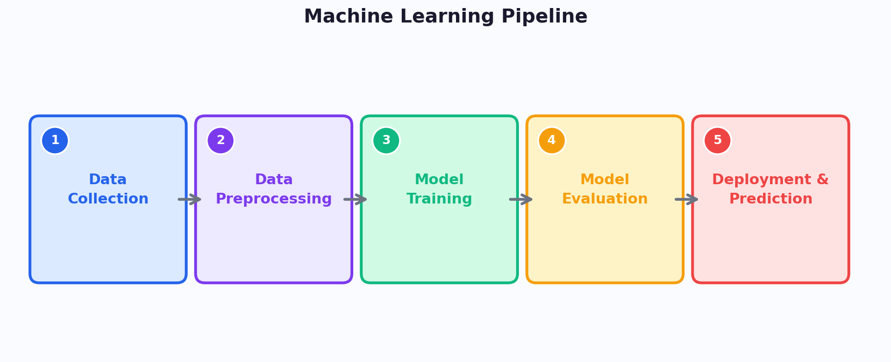
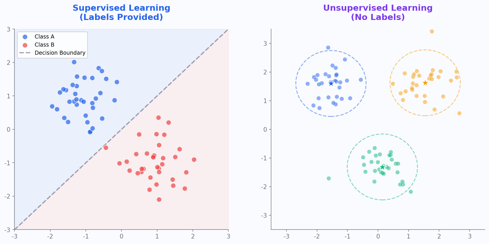
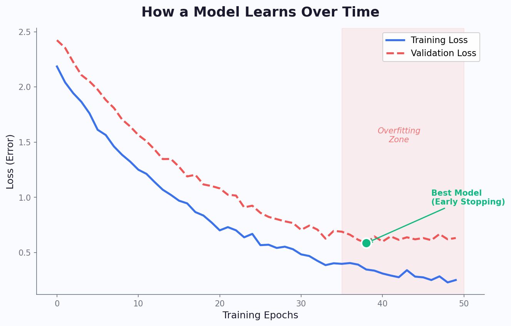
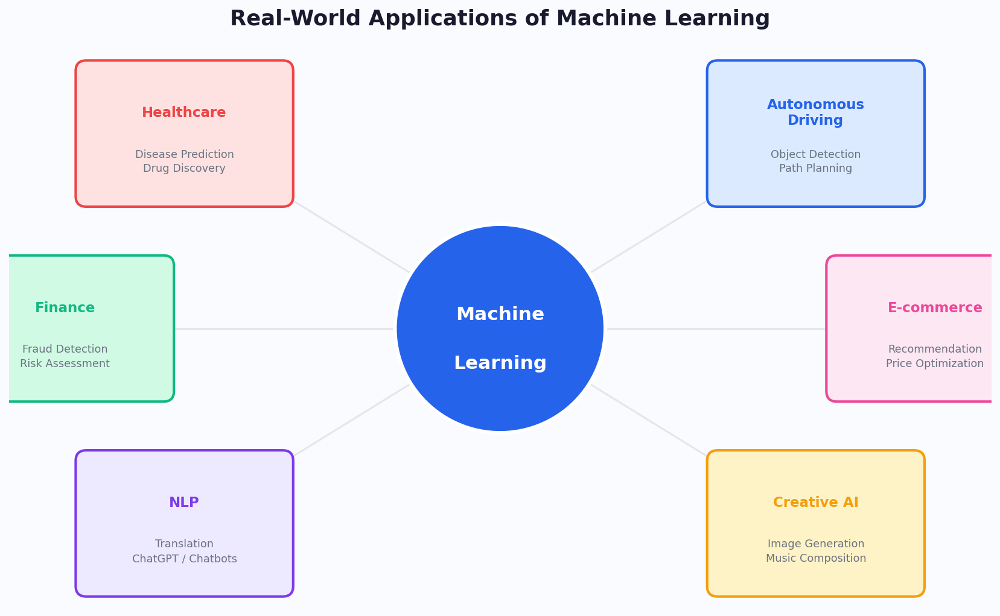

# 一文读懂机器学习：从原理到应用

> 你每天打开手机，推荐算法已经为你选好了新闻；你刷短视频，下一个视频恰好是你想看的；你网购结账，系统提醒你可能还需要的商品——这一切背后，都是**机器学习**在运作。

如果你对"机器学习"这个词感到陌生又好奇，这篇文章就是为你写的。我们不讲数学公式，不用晦暗术语，只用人话把这件事说清楚。

---

## 一、什么是机器学习？

### 从"人教机器"到"机器自学"

传统的计算机程序是这样的：程序员写下**每一步规则**，计算机严格照办。比如——

> 如果邮件标题包含"中奖"，就把它标记为垃圾邮件。

这种方式的问题在于：规则是人定的，但世界太复杂了。你能列出 100 条垃圾邮件的特征，骗子就能发明第 101 条绕过你。

**机器学习换了一个思路：**

> 不再由人写规则，而是让机器**从数据中自己发现规律**。

你只需要给机器看 10 万封邮件，告诉它"这 5 万封是垃圾邮件，那 5 万封是正常的"，它就能**自己总结出**区分两者的规则——而且可能比人总结得更好。

### 一个直觉比喻

想象你要教一个小孩认猫：

- **传统编程**：你写一本《猫的识别手册》——"猫有尖耳朵、长胡须、四条腿……"小孩按手册对照检查
- **机器学习**：你给小孩看 1000 张猫的照片和 1000 张不是猫的照片，告诉他哪些是猫，他自己就能学会认猫

哪种更靠谱？显然是后者。因为猫有千万种形态，你写不出完美手册，但大量示例足以让人（或机器）学会。

---

## 二、机器学习的五大步骤

机器学习不是魔法，它有一套清晰的流程：



| 步骤 | 做什么 | 举例 |
|------|--------|------|
| **1. 数据收集** | 收集与问题相关的数据 | 收集 10 万条用户购买记录 |
| **2. 数据预处理** | 清洗、整理、转换数据 | 处理缺失值、去除异常数据 |
| **3. 模型训练** | 让算法从数据中学习规律 | 用历史数据训练预测模型 |
| **4. 模型评估** | 检验模型准不准 | 用测试数据检查预测正确率 |
| **5. 部署应用** | 把模型投入使用 | 上线推荐系统，实时推荐商品 |

> **关键认知**：机器学习的核心不是算法，而是**数据**。没有好数据，再厉害的算法也无济于事——这就是所谓的"垃圾进，垃圾出"（Garbage In, Garbage Out）。

---

## 三、机器学习的三大类型

### 1. 监督学习（Supervised Learning）——有标准答案的学习

**核心思想**：给机器"带答案的练习题"，让它学会做题。

就像老师给学生做填空题——每道题都有标准答案，学生通过对照答案来调整自己的理解。



**典型应用**：

| 任务 | 输入（题目） | 输出（答案） | 应用场景 |
|------|-------------|-------------|---------|
| 分类 | 一封邮件的内容 | 垃圾/正常 | 邮件过滤 |
| 分类 | 一张肺部 CT 图 | 健康/异常 | 医疗诊断 |
| 回归 | 房屋面积、位置、楼层 | 房价（具体数字） | 房价预测 |
| 回归 | 历史销售数据 | 明天销量 | 库存管理 |

> **分类** vs **回归**：分类是"选择题"（输出是类别），回归是"填空题"（输出是数字）。

### 2. 无监督学习（Unsupervised Learning）——没有标准答案的学习

**核心思想**：给机器"没有答案的数据"，让它自己发现数据中的结构。

就像给小孩一堆混杂的积木，不告诉他分类规则，他自己可能会按颜色、形状、大小来分组。

**典型应用**：

- **客户分群**：银行把客户分成不同群体，针对性地推销理财产品
- **异常检测**：信用卡公司发现"和大多数交易不一样的"异常交易，可能是盗刷
- **主题发现**：从大量新闻中自动归纳出热点话题

### 3. 强化学习（Reinforcement Learning）——在试错中学习

**核心思想**：让机器在环境中不断行动，做对了奖励、做错了惩罚，逐渐学会最优策略。

就像训练小狗——做对了给零食，做错了不理它，慢慢地它就学会了各种指令。

**典型应用**：

- **AlphaGo**：通过和自己对弈数百万局，学会了围棋最优策略
- **自动驾驶**：车辆在虚拟环境中反复练习，学会在各种路况下安全驾驶
- **机器人控制**：机械臂反复尝试，学会精准抓取物体

---

## 四、经典机器学习算法——它们是怎么"学"的？

了解了三大类型，你可能会问：机器学习到底用**什么算法**来学？下面介绍几种最经典、最常用的算法，每一种都用一个生活比喻帮你理解。

### 1. 线性回归——画一条最合适的线

**比喻**：你在纸上画了一堆散点（比如每个房子的面积和价格），线性回归就是找到一条直线，让所有点到这条线的距离之和最小——这条线就是你的预测模型。

**适合场景**：预测一个连续数值，比如房价、销量、温度。

**优点**：简单、快速、结果可解释。
**缺点**：只能拟合线性关系，现实中数据往往更复杂。

### 2. 逻辑回归——非此即彼的判断

**比喻**：医生根据病人的各项指标判断"有病/没病"——不是输出一个具体数值，而是输出一个概率（比如 87% 的可能性是良性），然后根据阈值做判断。

**注意**：虽然名字里有"回归"，但它其实是**分类**算法，最常用于二分类问题。

**适合场景**：垃圾邮件判断、疾病诊断、用户是否会流失。

### 3. 决策树——像查字典一样做决定

**比喻**：你去医院看病，医生会一步步问你："发烧吗？"→"咳嗽吗？"→"体温多少？"……每个问题把可能性缩小一截，最终得出结论。决策树就是把这个过程自动化了。

```
                是否发烧？
               /         \
             是            否
            /               \
     体温>38°C？        咳嗽吗？
      /      \           /    \
   是        否        是      否
   /          \        /        \
流感        感冒    支气管炎   正常
```

**优点**：极其直观，结果可以画成流程图，人人都能看懂——这是决策树最大的优势：**可解释性**。
**缺点**：容易过拟合（树太深、太细致），泛化能力差。

### 4. 随机森林——三个臭皮匠顶个诸葛亮

**比喻**：一个医生的诊断可能有偏差，但如果**100 个医生**各自独立诊断，最后投票决定，准确率就高多了。随机森林就是这个思路：

1. 训练很多棵决策树（每棵用不同的数据子集和特征子集）
2. 每棵树独立做出预测
3. 分类问题：少数服从多数；回归问题：取平均值

**优点**：准确率高、抗过拟合、能处理高维数据。
**缺点**：模型大了就不像单棵树那样容易解释了。

> 随机森林至今仍是很多数据科学竞赛和实际业务中的首选算法——**简单、好用、不容易翻车**。

### 5. SVM（支持向量机）——找到最宽的分界线

**比喻**：操场上站着两群人（红队和蓝队），你要在中间拉一条绳子把他们分开。SVM 不是随便拉一条——而是找到那条让两边都离绳子**最远**的分界线，这样未来再来新的人，分错的概率最小。

**优点**：在小数据集上表现出色，数学理论优美。
**缺点**：大数据集上训练慢，不适合处理噪声多的数据。

### 6. K 近邻（KNN）——近朱者赤，近墨者黑

**比喻**：你刚搬到一个新小区，想知道自己大概属于什么收入水平。你看看最近的 5 户邻居，他们的平均收入就是你的估计值——这就是 KNN 的逻辑。

**优点**：无需训练过程，简单直观。
**缺点**：预测时需要和所有数据比较，数据量大时很慢；对特征尺度敏感（需要先标准化）。

### 7. K-Means 聚类——物以类聚

**比喻**：你拿到 1000 个客户的消费数据，想把他们分成几组来针对性营销。你先随机选 3 个中心点，然后让每个客户"投靠"最近的中心，再根据新分组重算中心点……反复迭代，直到分组稳定。

**适合场景**：无监督学习中的聚类任务——客户分群、图像分割、异常检测。

### 算法选择速查表

| 你的任务 | 数据特点 | 推荐算法 |
|---------|---------|--------|
| 预测数值 | 线性关系 | 线性回归 |
| 二分类 | 需要概率输出 | 逻辑回归 |
| 分类/回归 | 需要可解释性 | 决策树 |
| 分类/回归 | 追求高准确率 | 随机森林 |
| 分类 | 小数据、高维 | SVM |
| 分类/回归 | 小数据、快速原型 | KNN |
| 聚类 | 无标签数据 | K-Means |

> 这些都是"传统"机器学习算法，它们依赖**人工设计的特征**来工作。当数据是图像、语音、文本这种人类难以手工提取特征的形式时，就需要**深度学习**登场了——我们将在下一篇文章中专门讲解。

---

## 五、模型是怎样"学会"的？

### 学习过程的直觉

想象你在山上迷路了，想走到谷底（最低点）。你看不清全局，但你能感受到脚下哪边更陡。于是你**每次朝最陡的下坡方向走一步**，一步步走到谷底——这就是机器学习的核心算法：**梯度下降**。



这张图展示了模型学习过程中**误差（Loss）的变化**：

1. **初期**：误差急剧下降——模型在快速学习基本规律
2. **中期**：误差下降变慢——模型在精细调整
3. **后期**：训练误差继续降，但验证误差开始反弹——这就是**过拟合**

### 过拟合：学过了头

> 过拟合就像一个学生把考试答案**死记硬背**了，遇到新题就不会了。

模型在训练数据上表现极好，但在新数据上表现很差——它记住的是训练数据的"噪声"而非真正的规律。

**如何避免过拟合？**

- **更多数据**：让模型看到更多样化的例子
- **早停法（Early Stopping）**：在验证误差开始上升时就停止训练
- **正则化**：给模型加约束，防止它过于复杂
- **Dropout**：训练时随机"关闭"部分神经元，迫使模型学到更鲁棒的特征

---

## 六、机器学习能做什么？——真实应用一览



### 医疗健康

- **疾病风险预测**：基于患者的体检指标（血压、血糖、BMI 等），用逻辑回归预测糖尿病风险
- **药物研发**：用随机森林筛选出最可能有药效的分子结构，大幅缩小实验范围
- **个性化治疗**：根据患者数据聚类分析，为不同群体推荐最适合的治疗方案

### 自动驾驶

- **环境感知**：特斯拉的自动驾驶系统实时识别行人、车辆、交通标志
- **路径规划**：Waymo 的无人车每天在复杂路况下安全行驶数万公里
- **决策控制**：在毫秒级时间内做出刹车、转向等决策

### 自然语言处理

- **情感分析**：用 SVM 对用户评论自动分类为正面/负面，快速发现产品问题
- **垃圾邮件过滤**：用朴素贝叶斯分类器自动拦截垃圾邮件，准确率超过 99%
- **文本分类**：用逻辑回归自动将新闻归类到不同板块，替代人工编辑审核

> 更复杂的语言任务（如机器翻译、智能对话）需要**深度学习**技术，我们将在下一篇文章中展开。

### 电子商务

- **个性化推荐**：淘宝/京东的推荐算法贡献了超过 30% 的成交额
- **价格优化**：航空公司和酒店根据需求预测动态调整价格
- **库存管理**：预测各地区的商品需求，优化仓储和物流

### 金融科技

- **欺诈检测**：支付宝/微信支付在毫秒内判断每笔交易是否异常
- **信用评估**：蚂蚁金服的芝麻信用用数千个特征评估个人信用
- **量化交易**：对冲基金用机器学习模型预测市场走势

---

## 七、机器学习不能做什么？

客观地看，机器学习也有明确的边界：

| 局限 | 说明 |
|------|------|
| **需要大量数据** | 小数据场景下，传统方法可能更优 |
| **可解释性差异** | 传统算法（如决策树）可解释性强，但深度学习模型往往是"黑盒"，难以解释"为什么"做出某个判断 |
| **无法理解因果** | 模型发现的是相关性，不等于因果关系 |
| **对数据偏差敏感** | 如果训练数据有偏见，模型会放大这种偏见 |
| **缺乏常识** | 模型不理解世界的基本物理和社会规则 |

> 一个经典案例：某医院的 AI 系统学会了用"是否来自重症监护室"来预测肺炎风险——不是因为 ICU 导致肺炎，而是因为重症肺炎患者才被送进 ICU。模型学到了**相关关系**，但误解了**因果关系**。

---

## 八、如果你有兴趣进一步了解

对于不同背景的读者，推荐不同的入门路径：

### 高中生

1. 先学 Python 编程基础
2. 试试 Google 的 [Teachable Machine](https://teachablemachine.withgoogle.com/)——零代码训练自己的 AI
3. 推荐 Andrew Ng 的《Machine Learning for Everyone》系列视频

### 非专业本科生/研究生

1. 学习 Python + NumPy + Pandas 数据处理
2. 推荐吴恩达的 [Machine Learning 课程](https://www.coursera.org/learn/machine-learning)（Coursera 免费）
3. 动手实践：Kaggle 上的入门竞赛

### 管理层/决策者

1. 理解 AI 能做什么、不能做什么——避免盲目投资
2. 关注数据资产的建设——AI 的核心燃料是数据
3. 重视 AI 伦理和合规——偏见、隐私、可解释性是关键议题
4. 推荐《AI Superpowers》by 李开复——理解 AI 对商业和社会的影响

---

## 结语

机器学习不是魔法，它是**用数据说话的科学**。它的本质是：从经验（数据）中学习规律，然后用这些规律去预测和决策。

理解机器学习，不需要成为数学家或程序员。重要的是建立正确的直觉：

- **数据是核心**——没有好数据就没有好模型
- **相关不等于因果**——模型发现的是模式，不一定是真理
- **AI 是工具，不是替代品**——最强大的力量是人机协作

希望这篇文章能帮你打开机器学习的大门。

本文聚焦的是传统机器学习方法——它们依赖人工设计的特征，在表格数据、小数据场景下依然是非常强大的工具。但当面对图像、语音、文本这种人类难以手工提取特征的复杂数据时，就需要**深度学习**登场了。欢迎继续阅读姊妹篇：**《一文读懂深度学习：从神经网络到 ChatGPT 的进化之路》**。
