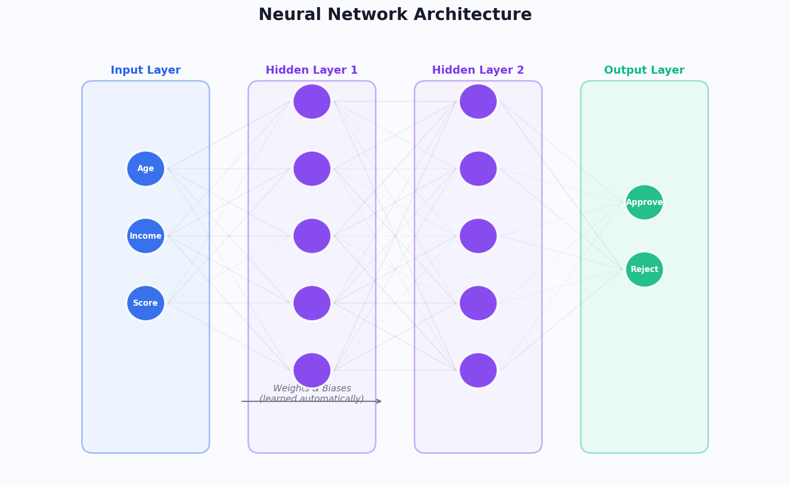

# 一文读懂机器学习：从原理到应用

> 你每天打开手机，推荐算法已经为你选好了新闻；你刷短视频，下一个视频恰好是你想看的；你网购结账，系统提醒你可能还需要的商品——这一切背后，都是**机器学习**在运作。

如果你对"机器学习"这个词感到陌生又好奇，这篇文章就是为你写的。我们不讲数学公式，不用晦暗术语，只用人话把这件事说清楚。

---

## 一、什么是机器学习？

### 从"人教机器"到"机器自学"

传统的计算机程序是这样的：程序员写下**每一步规则**，计算机严格照办。比如——

> 如果邮件标题包含"中奖"，就把它标记为垃圾邮件。

这种方式的问题在于：规则是人定的，但世界太复杂了。你能列出 100 条垃圾邮件的特征，骗子就能发明第 101 条绕过你。

**机器学习换了一个思路：**

> 不再由人写规则，而是让机器**从数据中自己发现规律**。

你只需要给机器看 10 万封邮件，告诉它"这 5 万封是垃圾邮件，那 5 万封是正常的"，它就能**自己总结出**区分两者的规则——而且可能比人总结得更好。

### 一个直觉比喻

想象你要教一个小孩认猫：

- **传统编程**：你写一本《猫的识别手册》——"猫有尖耳朵、长胡须、四条腿……"小孩按手册对照检查
- **机器学习**：你给小孩看 1000 张猫的照片和 1000 张不是猫的照片，告诉他哪些是猫，他自己就能学会认猫

哪种更靠谱？显然是后者。因为猫有千万种形态，你写不出完美手册，但大量示例足以让人（或机器）学会。

---

## 二、机器学习的五大步骤

机器学习不是魔法，它有一套清晰的流程：

| 步骤 | 做什么 | 举例 |
|------|--------|------|
| **1. 数据收集** | 收集与问题相关的数据 | 收集 10 万条用户购买记录 |
| **2. 数据预处理** | 清洗、整理、转换数据 | 处理缺失值、去除异常数据 |
| **3. 模型训练** | 让算法从数据中学习规律 | 用历史数据训练预测模型 |
| **4. 模型评估** | 检验模型准不准 | 用测试数据检查预测正确率 |
| **5. 部署应用** | 把模型投入使用 | 上线推荐系统，实时推荐商品 |

> **关键认知**：机器学习的核心不是算法，而是**数据**。没有好数据，再厉害的算法也无济于事——这就是所谓的"垃圾进，垃圾出"（Garbage In, Garbage Out）。

---

## 三、机器学习的三大类型

### 1. 监督学习（Supervised Learning）——有标准答案的学习

**核心思想**：给机器"带答案的练习题"，让它学会做题。

就像老师给学生做填空题——每道题都有标准答案，学生通过对照答案来调整自己的理解。

**典型应用**：

| 任务 | 输入（题目） | 输出（答案） | 应用场景 |
|------|-------------|-------------|---------|
| 分类 | 一封邮件的内容 | 垃圾/正常 | 邮件过滤 |
| 分类 | 一张肺部 CT 图 | 健康/异常 | 医疗诊断 |
| 回归 | 房屋面积、位置、楼层 | 房价（具体数字） | 房价预测 |
| 回归 | 历史销售数据 | 明天销量 | 库存管理 |

> **分类** vs **回归**：分类是"选择题"（输出是类别），回归是"填空题"（输出是数字）。

### 2. 无监督学习（Unsupervised Learning）——没有标准答案的学习

**核心思想**：给机器"没有答案的数据"，让它自己发现数据中的结构。

就像给小孩一堆混杂的积木，不告诉他分类规则，他自己可能会按颜色、形状、大小来分组。

**典型应用**：

- **客户分群**：银行把客户分成不同群体，针对性地推销理财产品
- **异常检测**：信用卡公司发现"和大多数交易不一样的"异常交易，可能是盗刷
- **主题发现**：从大量新闻中自动归纳出热点话题

### 3. 强化学习（Reinforcement Learning）——在试错中学习

**核心思想**：让机器在环境中不断行动，做对了奖励、做错了惩罚，逐渐学会最优策略。

就像训练小狗——做对了给零食，做错了不理它，慢慢地它就学会了各种指令。

**典型应用**：

- **AlphaGo**：通过和自己对弈数百万局，学会了围棋最优策略
- **自动驾驶**：车辆在虚拟环境中反复练习，学会在各种路况下安全驾驶
- **机器人控制**：机械臂反复尝试，学会精准抓取物体

---

## 四、神经网络与深度学习——模拟大脑的学习

### 什么是神经网络？

神经网络是机器学习中最热门的模型，灵感来自人脑中神经元的连接方式。

看这张图，数据从**输入层**进入，经过**隐藏层**的一层层计算，最终在**输出层**给出结果。每一层都会对信息进行加工和提取：

- **输入层**：接收原始数据（如年龄、收入、信用分数）
- **隐藏层**：自动提取特征（如发现"年龄大+收入低=高风险"这种规律）
- **输出层**：给出最终判断（如：批准/拒绝贷款）

> 关键点：隐藏层中的**权重和偏置**是机器自己学出来的，不需要人工设定。训练的过程就是不断调整这些参数，让输出越来越准确。

### 深度学习 = 更深的神经网络

当隐藏层很多（几十甚至上百层）时，就叫**深度学习**。层数越多，模型能学到的规律就越复杂：

| 层数 | 能学什么 | 举例 |
|------|---------|------|
| 1-2 层 | 简单的线性关系 | 房价与面积成正比 |
| 5-10 层 | 中等复杂度的模式 | 图片中的边缘和纹理 |
| 50-100+ 层 | 非常复杂的抽象特征 | 人脸识别、自然语言理解 |

### 大模型：深度学习的最新突破

你可能听说过 **ChatGPT、GPT-4、文心一言** 这些大模型——它们就是超大规模的深度学习模型：

- GPT-3 有 **1750 亿个参数**（相当于 1750 亿个"权重旋钮"需要调整）
- 训练它需要阅读互联网上几乎所有的英文文本
- 训练一次的电力成本相当于**数百万元人民币**

大模型之所以强大，是因为它在海量数据上学到了极其丰富的语言规律，从而能够理解和生成自然语言。

---

## 五、模型是怎样"学会"的？

### 学习过程的直觉

想象你在山上迷路了，想走到谷底（最低点）。你看不清全局，但你能感受到脚下哪边更陡。于是你**每次朝最陡的下坡方向走一步**，一步步走到谷底——这就是机器学习的核心算法：**梯度下降**。

这张图展示了模型学习过程中**误差（Loss）的变化**：

1. **初期**：误差急剧下降——模型在快速学习基本规律
2. **中期**：误差下降变慢——模型在精细调整
3. **后期**：训练误差继续降，但验证误差开始反弹——这就是**过拟合**

### 过拟合：学过了头

> 过拟合就像一个学生把考试答案**死记硬背**了，遇到新题就不会了。

模型在训练数据上表现极好，但在新数据上表现很差——它记住的是训练数据的"噪声"而非真正的规律。

**如何避免过拟合？**

- **更多数据**：让模型看到更多样化的例子
- **早停法（Early Stopping）**：在验证误差开始上升时就停止训练
- **正则化**：给模型加约束，防止它过于复杂
- **Dropout**：训练时随机"关闭"部分神经元，迫使模型学到更鲁棒的特征

---

## 六、机器学习能做什么？——真实应用一览

### 医疗健康

- **疾病预测**：Google 的深度学习模型在乳腺癌筛查中，准确率超过了放射科医生
- **药物研发**：AlphaFold 预测蛋白质结构，将原本需要数月的实验缩短到数小时
- **个性化治疗**：根据患者基因组数据，推荐最有效的治疗方案

### 自动驾驶

- **环境感知**：特斯拉的自动驾驶系统实时识别行人、车辆、交通标志
- **路径规划**：Waymo 的无人车每天在复杂路况下安全行驶数万公里
- **决策控制**：在毫秒级时间内做出刹车、转向等决策

### 自然语言处理

- **机器翻译**：Google 翻译在引入神经网络后，翻译质量实现了质的飞跃
- **智能对话**：ChatGPT 能够理解上下文、生成连贯的长文本、编写代码
- **情感分析**：企业自动分析用户评论中的情绪倾向，快速发现产品问题

### 电子商务

- **个性化推荐**：淘宝/京东的推荐算法贡献了超过 30% 的成交额
- **价格优化**：航空公司和酒店根据需求预测动态调整价格
- **库存管理**：预测各地区的商品需求，优化仓储和物流

### 金融科技

- **欺诈检测**：支付宝/微信支付在毫秒内判断每笔交易是否异常
- **信用评估**：蚂蚁金服的芝麻信用用数千个特征评估个人信用
- **量化交易**：对冲基金用机器学习模型预测市场走势

---

## 七、机器学习不能做什么？

客观地看，机器学习也有明确的边界：

| 局限 | 说明 |
|------|------|
| **需要大量数据** | 小数据场景下，传统方法可能更优 |
| **黑盒问题** | 深度学习模型难以解释"为什么"做出某个判断 |
| **无法理解因果** | 模型发现的是相关性，不等于因果关系 |
| **对数据偏差敏感** | 如果训练数据有偏见，模型会放大这种偏见 |
| **缺乏常识** | 模型不理解世界的基本物理和社会规则 |

> 一个经典案例：某医院的 AI 系统学会了用"是否来自重症监护室"来预测肺炎风险——不是因为 ICU 导致肺炎，而是因为重症肺炎患者才被送进 ICU。模型学到了**相关关系**，但误解了**因果关系**。

---

## 八、如果你有兴趣进一步了解

对于不同背景的读者，推荐不同的入门路径：

### 高中生

1. 先学 Python 编程基础
2. 试试 Google 的 [Teachable Machine](https://teachablemachine.withgoogle.com/)——零代码训练自己的 AI
3. 推荐 Andrew Ng 的《Machine Learning for Everyone》系列视频

### 非专业本科生/研究生

1. 学习 Python + NumPy + Pandas 数据处理
2. 推荐吴恩达的 [Machine Learning 课程](https://www.coursera.org/learn/machine-learning)（Coursera 免费）
3. 动手实践：Kaggle 上的入门竞赛

### 管理层/决策者

1. 理解 AI 能做什么、不能做什么——避免盲目投资
2. 关注数据资产的建设——AI 的核心燃料是数据
3. 重视 AI 伦理和合规——偏见、隐私、可解释性是关键议题
4. 推荐《AI Superpowers》by 李开复——理解 AI 对商业和社会的影响

---

## 结语

机器学习不是魔法，它是**用数据说话的科学**。它的本质是：从经验（数据）中学习规律，然后用这些规律去预测和决策。

理解机器学习，不需要成为数学家或程序员。重要的是建立正确的直觉：

- **数据是核心**——没有好数据就没有好模型
- **相关不等于因果**——模型发现的是模式，不一定是真理
- **AI 是工具，不是替代品**——最强大的力量是人机协作

希望这篇文章能帮你打开机器学习的大门。如果你有任何问题，欢迎留言讨论。
